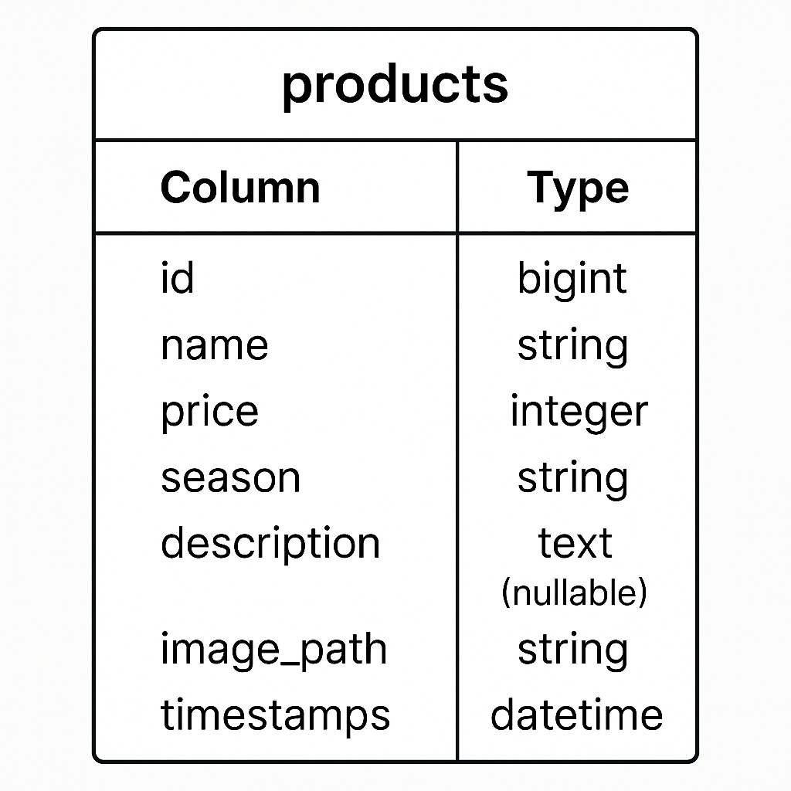

# mogitate（フルーツ商品一覧アプリ）

## 🌱 環境構築

以下の手順でローカル開発環境を構築できます。

### 1. リポジトリをクローン

```bash
git clone https://github.com/harumizuki/mogitate.git
cd mogitate

docker compose up -d --build

Laravel セットアップ

docker compose exec app bash
composer install
cp .env.example .env
php artisan key:generate
php artisan migrate
php artisan storage:link

🛠 使用技術（実行環境）

PHP 8.0.x
Laravel 8.x
MySQL 8.0.x
Docker / Docker Compose

🖼 ER図


🌐 URL（開発環境）

アプリ本体： http://localhost:8080


